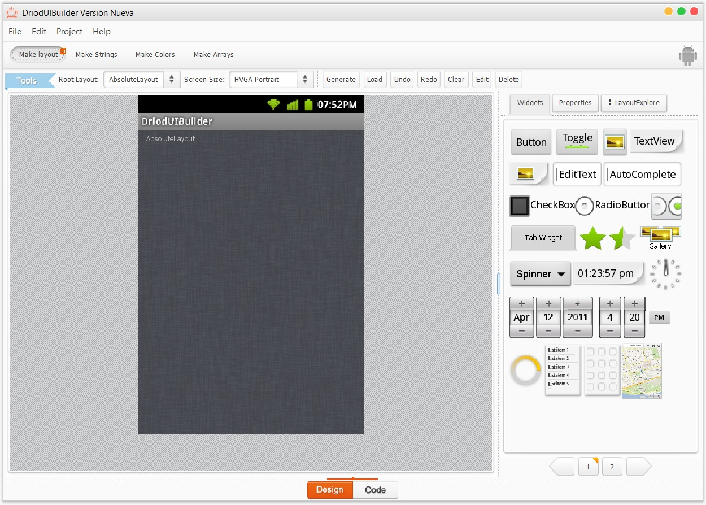

# DroidUIBuilder New Version

## Introduction

DroidUIBuilder is a deprecated conventional Android GUI design tool, but its version is too old and the designed interface style is based on Android 2.x, so it is only for research use. My modified version is based on [JackJiang2011's repository](https://github.com/JackJiang2011/DroidUIBuilder) in order to run on Java 11, together with his [BeautyEye](https://github.com/JackJiang2011/beautyeye) for theme changing of Java Swing GUI.

## Screenshots
